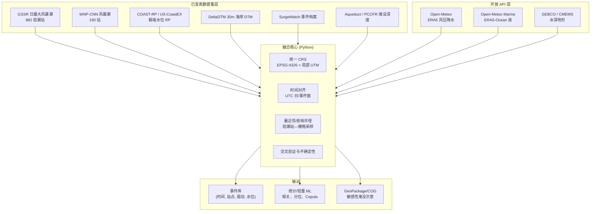

# 海岸洪水多源开放数据融合论文实施计划

> **工作区**：`e:\Projects\20260522-coastal-flood-scientific-data`  
> **编制日期**：2026-05-22  
> **约束**：仅使用已发表、可公开下载的数据与代码；不依赖需购买的专有数据；用户不手工补录观测。

---

## 执行摘要

本计划基于 **10 项** Scientific Data / Nature 系列及密切关联的开放海岸洪水数据源，提出一篇以 **“多源已发表数据 + Open-Meteo 气象/海浪 + 开放海洋地形”** 为核心的可复现融合研究。创新点在于：在**不重新运行全球水动力模型**的前提下，用统一时空框架交叉验证 **重建风暴潮（GSSR/WNP）—极端水位重现期（COAST-RP/US-CoastEX）—海岸地形（DeltaDTM）—气象驱动（Open-Meteo）**，并给出事件级与气候态两套分析路径。

**推荐优先落地的三数据集组合**（详见 §5.3）：

1. **GSSR + DeltaDTM + Open-Meteo ERA5 + COAST-RP**（全球验潮站，代码最完整）
2. **US-CoastEX + DeltaDTM + Open-Meteo + GEBCO**（美国海岸，含 Bayesian 极端值与 Zenodo 代码）
3. **WNP CNN 风暴潮 + SurgeWatch2.0 + Open-Meteo Marine + DeltaDTM**（西北太平洋 + 英国事件档案，事件叙事强）

---

## 1. 文献与数据源目录（10 项核心 + 3 项补充）

### 1.1 Scientific Data（Nature Portfolio）


| #   | 论文标题（EN）                                                                                                             | 期刊 / 年                    | 论文 DOI                                                                   | 数据集名称                                        | 空间 / 时间 / 分辨率                           | 格式                                   | 代码仓库                                                                                                                                                                                                            | 语言                           | 许可 / 体量 / 获取                                                                            | 几何丰富度                          |
| --- | -------------------------------------------------------------------------------------------------------------------- | ------------------------- | ------------------------------------------------------------------------ | -------------------------------------------- | --------------------------------------- | ------------------------------------ | --------------------------------------------------------------------------------------------------------------------------------------------------------------------------------------------------------------- | ---------------------------- | --------------------------------------------------------------------------------------- | ------------------------------ |
| 1   | *A database of global storm surge reconstructions*                                                                   | **Scientific Data**, 2021 | [10.1038/s41597-021-00906-x](https://doi.org/10.1038/s41597-021-00906-x) | **GSSR** (Global Storm Surge Reconstruction) | 全球 **882** 验潮站；日最大风暴潮；1836–2019（依再分析产品） | 每站 CSV + 元数据                         | 脚本：[Figshare 10.6084/m9.figshare.12978191](https://doi.org/10.6084/m9.figshare.12978191)；数据集合：[10.6084/m9.figshare.c.5124878](https://doi.org/10.6084/m9.figshare.c.5124878)；门户 [gssr.info](https://gssr.info/) | Python（MLR/Random Forest 流程） | 开放研究使用；全库约 GB 级；HTTP 批量或交互下载                                                            | 验潮站点坐标；无栅格淹没面                  |
| 2   | *A dataset of storm surge reconstructions in the Western North Pacific using CNN*                                    | **Scientific Data**, 2024 | [10.1038/s41597-024-03249-5](https://doi.org/10.1038/s41597-024-03249-5) | **WNP-CNN Surge**                            | 西北太平洋 **160** 站；1900–2010；日最大风暴潮        | CSV + 验证元数据                          | 训练代码同 Figshare：[10.6084/m9.figshare.c.6949023](https://doi.org/10.6084/m9.figshare.c.6949023.v1)                                                                                                                | Python (CNN)                 | 开放；单站 CSV 轻量                                                                            | 验潮站几何                          |
| 3   | *DeltaDTM: A global coastal digital terrain model*                                                                   | **Scientific Data**, 2024 | [10.1038/s41597-024-03091-9](https://doi.org/10.1038/s41597-024-03091-9) | **DeltaDTM**                                 | 全球 LECZ（<10 m MSL）；**~30 m**（1 arcsec）  | COG GeoTIFF、mask、**GeoPackage** 瓦片索引 | [Zenodo DeltaDTM.jl 10.5281/zenodo.10051452](https://doi.org/10.5281/zenodo.10051452)；GEE：`users/maartenpronk/deltadtm/v1`                                                                                      | **Julia**（处理）；可用 Python 读取栅格 | CC 数据论文惯例；**数十 GB**（按洲 zip）；[4TU 10.4121/21997565](https://doi.org/10.4121/21997565.v2) | **DEM/DTM**、海岸线 LECZ、瓦片矢量边界    |
| 4   | *US-CoastEX: Observation-based probabilistic reanalysis of storm surge and sea level extremes for the United States* | **Scientific Data**, 2025 | [10.1038/s41597-025-05730-1](https://doi.org/10.1038/s41597-025-05730-1) | **US-CoastEX**                               | 美国海岸验潮/无测站格点；偏斜风暴潮与 ESL 重现期             | **NetCDF**（~15 GB，4 文件）              | **BAYEX**：[Zenodo 10.5281/zenodo.10967174](https://zenodo.org/records/10967174)；数据：[10.5281/zenodo.14915031](https://doi.org/10.5281/zenodo.14915031)                                                           | Python / R（Bayesian 极值）      | 开放；需稳定带宽                                                                                | 海岸点/格点；与 COAST-RP 可对比          |
| 5   | *A user-friendly database of coastal flooding in the United Kingdom from 1915–2014*                                  | **Scientific Data**, 2015 | [10.1038/sdata201521](https://doi.org/10.1038/sdata201521)               | **SurgeWatch v1.0**                          | 英国；**96** 场风暴事件；1915–2014               | CSV（气象+水位）+ PDF 事件说明                 | 无独立 GitHub；结构化 CSV                                                                                                                                                                                              | —                            | BODC 开放库；[surgewatch.org](http://www.surgewatch.org)                                    | 事件轨迹 CSV、40 验潮站表；**事件级**几何     |
| 6   | *An improved database of coastal flooding in the United Kingdom from 1915 to 2016*                                   | **Scientific Data**, 2017 | [10.1038/sdata2017100](https://doi.org/10.1038/sdata2017100)             | **SurgeWatch2.0**                            | 英国；**329** 次海岸洪水事件；至 2016               | XLSX 目录 + CSV（53 场严重事件轨迹/峰值水位）+ PDF  | 同 v1；网站可众包照片                                                                                                                                                                                                    | —                            | BODC；与 v1 方法一致                                                                          | 风暴路径线、峰值水位/天文潮/偏斜潮；**事件叙事+几何** |


### 1.2 Nature Communications / Communications Earth & Environment


| #   | 论文标题（EN）                                                                                                               | 期刊 / 年                                       | 论文 DOI                                                                   | 数据集                           | 空间 / 时间 / 分辨率                      | 格式                                                                                                                 | 代码                                                                                                                                  | 几何丰富度               |
| --- | ---------------------------------------------------------------------------------------------------------------------- | -------------------------------------------- | ------------------------------------------------------------------------ | ----------------------------- | ---------------------------------- | ------------------------------------------------------------------------------------------------------------------ | ----------------------------------------------------------------------------------------------------------------------------------- | ------------------- |
| 7   | *Accounting for tropical cyclones more than doubles the global population exposed to low-probability coastal flooding* | **Communications Earth & Environment**, 2021 | [10.1038/s43247-021-00204-9](https://doi.org/10.1038/s43247-021-00204-9) | **COAST-RP**                  | 全球海岸点；风暴潮位 **1–1000 年**重现期         | NetCDF（轻量，~3 MB 级）                                                                                                 | 部分：[TCM](https://github.com/nlesc-mosaic/TCM)、[STORM-return-periods](https://github.com/NBloemendaal/STORM-return-periods)；主流程需联系作者 | 海岸点 + 重现期水位（无淹没多边形） |
| 8   | *Global mapping of potential coastal compound flood risk at 0.1° resolution*                                           | **Communications Earth & Environment**, 2026 | [10.1038/s43247-025-03155-7](https://doi.org/10.1038/s43247-025-03155-7) | **PCCFR**（基于 Aqueduct Floods） | 全球 **0.1°**；河流+海洋洪水 **5–1000 年**   | 分析网格 CSV：[Figshare 10.6084/m9.figshare.30782060](https://doi.org/10.6084/m9.figshare.30782060)；淹没深度来自 WRI Aqueduct | [GitHub: Coastal-Compound-Flood-Risk](https://github.com/zhangjiaqi1996/Coastal-Compound-Flood-Risk)                                | 栅格化复合洪水风险；可与风暴潮交叉   |
| 9   | *A global reanalysis of storm surges and extreme sea levels*                                                           | **Nature Communications**, 2016              | [10.1038/ncomms11969](https://doi.org/10.1038/ncomms11969)               | **GTSR**（前代全球极值海平面）           | 全球海岸 **~2.5 km** GTSM 节点；1980–至今统计 | 再分析产品相关；被 **CoDEC** 取代                                                                                             | GTSM 开源组件（Deltares）                                                                                                                 | 极值水位统计点             |


### 1.3 密切关联开放数据论文（非 Scientific Data，可支撑淹没几何）


| #   | 论文 / 数据                                                                                | 期刊 / 年                                | DOI                                                                      | 数据集                         | 格式                                                                      | 几何                   |
| --- | -------------------------------------------------------------------------------------- | ------------------------------------- | ------------------------------------------------------------------------ | --------------------------- | ----------------------------------------------------------------------- | -------------------- |
| 10  | *Enabling dynamic modelling of coastal flooding by defining storm tide hydrographs*    | **NHESS**, 2023                       | [10.5194/nhess-23-1847-2023](https://doi.org/10.5194/nhess-23-1847-2023) | **COAST-HG**                | NetCDF **~168 MB**；100 年一遇风暴潮过程线                                        | 时间序列形状；与 COAST-RP 配套 |
| —   | *A High-Resolution Global Dataset of Extreme Sea Levels…* (**CoDEC**)                  | **Frontiers in Marine Science**, 2020 | [10.3389/fmars.2020.00263](https://doi.org/10.3389/fmars.2020.00263)     | **CoDEC / GTSMv3**          | Zenodo：[10.5281/zenodo.3660927](https://doi.org/10.5281/zenodo.3660927) | 全球海岸极值；**补充** GTSR   |
| —   | *Global Dataset of Extreme Sea Levels and Coastal Flood Impacts over the 21st Century* | **Data**, 2025                        | [10.3390/data10020015](https://doi.org/10.3390/data10020015)             | DIVA 点 + **淹没范围 shapefile** | NetCDF ESL + **.shp** 淹没面                                               | **面状淹没几何**（情景型）      |


### 1.4 补充参考（非 Nature 主列表，标记 *supplementary*）


| 名称                             | 引用                        | DOI / 链接                                                                                                                        | 用途                              |
| ------------------------------ | ------------------------- | ------------------------------------------------------------------------------------------------------------------------------- | ------------------------------- |
| **MERIT DEM** *supplementary*  | Yamazaki et al., GRL 2017 | [10.1002/2017GL072874](https://doi.org/10.1002/2017GL072874)；[下载页](http://hydro.iis.u-tokyo.ac.jp/~yamadai/MERIT_DEM/)          | 全球 ~90 m 裸地地形；与 DeltaDTM 对比/敏感性 |
| **GTSR** *supplementary*       | 见 #9                      | 同 CoDEC 文档                                                                                                                      | 极端海平面基线                         |
| **GEBCO** *supplementary*      | GEBCO 2024/2026 Grid      | [gebco.net](https://www.gebco.net/data-products/gridded-bathymetry-data)；CEDA/OPeNDAP                                           | 15 arcsec 海底地形；公共领域             |
| **CMEMS 海岸水深** *supplementary* | Copernicus Marine         | [BATHYMETRY_GLO_PHY_COASTAL_L4](https://data.marine.copernicus.eu/product/BATHYMETRY_GLO_PHY_COASTAL_L4_MY_016_001/description) | 100 m 卫星反演海岸带水深；免费注册下载          |


---

## 2. 开放 API 集成：Open-Meteo 与海洋/海岸数据

### 2.1 Open-Meteo（无需 API Key，适合自动化）


| API                    | 端点                                              | 与洪水事件对齐的变量                                                                                                                                                        | 时间对齐建议                                                             |
| ---------------------- | ----------------------------------------------- | ----------------------------------------------------------------------------------------------------------------------------------------------------------------- | ------------------------------------------------------------------ |
| **Historical Weather** | `https://archive-api.open-meteo.com/v1/archive` | `pressure_msl`, `wind_speed_10m`, `wind_direction_10m`, `wind_gusts_10m`, `precipitation`, `temperature_2m`；模型选 **ERA5** 或 **ERA5-Land**（1940/1950 至今，0.25°/0.1°） | 与 GSSR **日最大偏斜潮** 对齐：事件日 ±3–7 天提取极值风压与累积降水（复合洪水）                   |
| **Marine Weather**     | `https://marine-api.open-meteo.com/v1/marine`   | `wave_height`, `wave_period`, `wave_direction`, `wind_wave_height`, `swell_wave_height`；历史用 `**models=era5_ocean`**（1940 至今，0.5° 逐时）                              | 与 SurgeWatch 英国事件、WNP 台风季样本对齐；**注意**：ERA5-Ocean 无风暴潮水位，海冰区波浪可为 NaN |
| **Forecast（可选）**       | `https://api.open-meteo.com/v1/forecast`        | 同上，用于“近实时”演示流水线                                                                                                                                                   | 仅作方法附录，不作历史主结论                                                     |


**重要限制（须在论文中写明）**：Open-Meteo **不提供** 风暴潮或验潮站水位；只能作为 **气象/海浪驱动因子**，与 GSSR/US-CoastEX 等水位产品做 **统计相关/条件极值/事件匹配**，不能替代水动力模拟。

**示例请求（ERA5 风压，验潮站邻域）**：

```text
https://archive-api.open-meteo.com/v1/archive?latitude=51.5&longitude=-3.2&start_date=2014-01-05&end_date=2014-01-08&hourly=pressure_msl,wind_speed_10m,wind_gusts_10m,precipitation&models=era5
```

**示例请求（ERA5-Ocean 波浪）**：

```text
https://marine-api.open-meteo.com/v1/marine?latitude=35.0&longitude=139.0&start_date=2011-03-10&end_date=2011-03-12&hourly=wave_height,wave_period&models=era5_ocean
```

### 2.2 开放海洋/海岸数据源（推荐优先级）


| 数据源                        | 开放性             | 获取方式                          | 在流水线中的角色                           |
| -------------------------- | --------------- | ----------------------------- | ---------------------------------- |
| **GEBCO Grid**             | 公共领域            | HTTPS/OPeNDAP（CEDA）           | 离岸水深、大陆架地形；构建海岸横断面                 |
| **Copernicus Marine 海岸水深** | 免费注册            | `copernicusmarine` Python 工具箱 | 0–10 m 浅海精细水深（与 DeltaDTM 衔接）       |
| **CoDEC / GTSR（Zenodo）**   | 开放              | `zenodo_get` / HTTP           | 全球 ESL 重现期，与 COAST-RP 交叉验证         |
| **FES2014**                | 研究免费（AVISO+ 注册） | SFTP                          | 天文潮调和分析；与偏斜潮合成 **总水位**（需注明潮汐模型版本）  |
| **NOAA CO-OPS / GESLA3**   | 开放              | THREDDS/CSV（验潮站观测）            | **仅**验证 GSSR/US-CoastEX，不作为“新数据”宣称 |
| **IBTrACS**                | 开放              | NOAA NCEI                     | 热带气旋路径，解释 TC 型风暴潮事件                |


**不建议作为主数据**：Fathom Global Flood Map（商业）、CoastalDEM（非商业申请）——违反“全自动公开获取”约束。

---

## 3. 多源融合架构

### 3.1 逻辑分层




### 3.2 融合模式（择一为主、其余为稳健性检验）


| 模式                              | 适用数据                                | 做法                                                         | 产出              |
| ------------------------------- | ----------------------------------- | ---------------------------------------------------------- | --------------- |
| **A. 事件一致（Event-based）**        | SurgeWatch + Open-Meteo + GSSR 英站子集 | 以事件 CSV 中 `start/end` 或峰值日为中心 ±72 h 拉 ERA5；计算风压/降水极值与偏斜潮相关 | 事件驱动回归 / 分位耦合   |
| **B. 站点气候态（Gauge climatology）** | GSSR + COAST-RP + CoDEC             | 每站对齐 RP=10/100 年水位；比较重建潮与模型极值偏差                            | 全球偏差地图、分区箱线图    |
| **C. 栅格静态淹没（Hazard screen）**    | DeltaDTM + COAST-RP 100y + bathtub  | `inundation = max(0, ESL_100y - DTM)`（明确为 **静态筛查**，非动力淹没）  | 敏感性淹没面（GeoTIFF） |
| **D. 复合洪水（Compound）**           | PCCFR 0.1° + Open-Meteo 降水极值        | 高海洋洪水潜势 ∧ 高降水极值 → 复合热点                                     | 0.1° 风险叠置图      |


### 3.3 技术对齐清单


| 要素       | 建议                                                |
| -------- | ------------------------------------------------- |
| **CRS**  | 存储 WGS84；分析淹没时用局部 **UTM**（按研究区）                   |
| **垂直基准** | 统一至 **MSL** 或显式记录 CD/EGM96；DeltaDTM 与 ESL 产品逐文献核对 |
| **时间**   | 验潮站 UTC；ERA5 逐时；日最大潮取 **日历日 max** 与 GSSR 一致       |
| **空间匹配** | 验潮站缓冲 **0.25°** 内 ERA5 网格平均；DeltaDTM 双线性采样        |
| **不确定性** | 传播 GSSR 预测区间、US-CoastEX 贝叶斯区间、DTM ±0.45 m MAE     |


---

## 4. 论文方案（详细）

### 4.1 中英文题目


| 语言     | 题目                                                                                                                                                        |
| ------ | --------------------------------------------------------------------------------------------------------------------------------------------------------- |
| **EN** | *A reproducible multi-source fusion framework for coastal flood hazard: linking published surge reconstructions, coastal terrain, and Open-Meteo drivers* |
| **CN** | **面向海岸洪水危害的可复现多源融合框架：联结已发表风暴潮重建、海岸地形与 Open-Meteo 气象驱动**                                                                                                   |


### 4.2 创新点与科学缺口

1. **缺口**：现有 Scientific Data 论文各自提供水位、地形或事件清单，但 **缺少** 在统一开源流水线中对 **“重建潮—极值重现期—30 m DTM—再分析风压/浪”** 的系统性交叉验证。
2. **创新**：提出 **纯开放数据、零专有输入** 的融合协议（含版本锁定与 Zenodo/Figshare 快照 DOI）。
3. **贡献**：
  - 量化 GSSR 与 COAST-RP/CoDEC 在共站点的 RP 偏差带；  
  - 用 Open-Meteo 驱动解释 **复合洪水热点**（与 PCCFR 对照）；  
  - 基于 DeltaDTM 给出 **静态淹没敏感性** 及 DTM 误差传播；  
  - 发布可复现代码与 **小型事件库**（GeoPackage）。

### 4.3 方法章节提纲

1. **数据来源与版本锁定**（表 1：10 数据集 DOI + 下载日期 + checksum）
2. **研究区设计**（最小可行：英国 SurgeWatch + GSSR 子集；扩展：美国 US-CoastEX；全球热点：西北太平洋 WNP）
3. **时空预处理**（CRS、垂直基准、缺测）
4. **Open-Meteo 提取协议**（事件窗、变量、模型=ERA5/era5_ocean）
5. **交叉验证设计**
  - 重建潮 vs 观测（GESLA3 子集，仅验证）  
  - 重建潮 vs COAST-RP/US-CoastEX RP  
  - 静态淹没：ESL vs DeltaDTM
6. **统计与轻量学习**（见 §4.5）
7. **不确定性**（DTM MAE、预测区间、模型间 spread）
8. **可复现性**（Snakemake/DVC、环境文件、Zenodo 归档）

### 4.4 预期图表


| 图/表         | 内容                                                           |
| ----------- | ------------------------------------------------------------ |
| **Fig. 1**  | 融合架构示意图（§3 Mermaid 精修版）                                      |
| **Fig. 2**  | 研究区与验潮站/事件分布（SurgeWatch + GSSR）                              |
| **Fig. 3**  | 典型事件（如 2013/2014 英国风暴）风压/降水/偏斜潮时间序列（Open-Meteo + SurgeWatch） |
| **Fig. 4**  | 全球或分区：GSSR 极值 vs COAST-RP 100y 散点 + 回归                       |
| **Fig. 5**  | DeltaDTM 静态淹没敏感性（100y ESL）vs MERIT *supplementary* 对比        |
| **Fig. 6**  | 复合洪水：PCCFR 海洋危害 × Open-Meteo 降水极值热点                          |
| **Table 1** | 数据源元数据与许可                                                    |
| **Table 2** | 验证指标（RMSE、偏差、相关、RP 相对误差）                                     |
| **Suppl.**  | API 请求模板、Snakemake DAG、代理分析（轻量 LLM 仅用于事件摘要生成，可选）             |


### 4.5 统计与轻量 ML / Agent 工作流（Python，可行）


| 步骤                  | 方法                                                           | 工具                                         |
| ------------------- | ------------------------------------------------------------ | ------------------------------------------ |
| 驱动—潮位相关             | Spearman / 分位回归（风压、降水 vs 日最大偏斜潮）                             | `scipy`, `statsmodels`                     |
| 多变量极值               | **Copula**（Gaussian / Gumbel）用于降水+偏斜潮联合重现期（探索性）              | `copulas` / `pyvinecopulib`                |
| 站点分类                | **HDBSCAN/KMeans** 对事件风压特征聚类（天气型）                            | `sklearn`                                  |
| 轻量预测（可选）            | **Gradient Boosting** 用 Open-Meteo 特征预测 GSSR 日最大潮（解释性，非预报业务） | `xgboost` / `lightgbm`                     |
| **Agent 工作流（可选附录）** | 读取 SurgeWatch PDF/CSV → 结构化事件摘要 → 自动生成 Methods 草稿段落；**人工审核** | `langchain` + 本地 LLM 或 API；**不**作为科学结论唯一依据 |


### 4.6 分阶段实施路线图


| 阶段            | 周次     | 任务                                                                  | 交付物                       |
| ------------- | ------ | ------------------------------------------------------------------- | ------------------------- |
| **P0 环境与清单**  | W1     | `conda` 环境；下载 3 个核心集（GSSR 子集、DeltaDTM 1 洲、COAST-RP）；Open-Meteo 冒烟测试 | `data/manifest.yml`, 下载脚本 |
| **P1 英国 MVP** | W2–W3  | SurgeWatch2 + GSSR 英站 + ERA5 事件窗；复现 2 场经典风暴                         | 事件 GeoPackage、Fig. 3 草稿   |
| **P2 全球对比**   | W4–W5  | 共站点 GSSR–COAST-RP–CoDEC；偏差地图                                        | Fig. 4、Table 2            |
| **P3 地形淹没**   | W6     | DeltaDTM bathtub + MERIT 敏感性                                        | Fig. 5                    |
| **P4 复合洪水**   | W7     | PCCFR + 降水极值；GitHub 代码 fork 适配                                      | Fig. 6                    |
| **P5 美国扩展**   | W8     | US-CoastEX 对比 COAST-RP（论文已有图式，复现+融合）                                | 美国子区附录                    |
| **P6 写作与归档**  | W9–W10 | 全文、Zenodo 代码+数据快照、投稿 *Scientific Data* 或 *ESSD*                     | 手稿 + 仓库 release           |


### 4.7 风险与缓解


| 风险                     | 影响       | 缓解                              |
| ---------------------- | -------- | ------------------------------- |
| DeltaDTM 体量过大          | 下载/存储瓶颈  | 按研究区瓦片裁剪；GEE 导出子区               |
| 垂直基准不一致                | 淹没深度偏差   | 文献元数据表 + 仅做 **相对** 敏感性分析        |
| Open-Meteo 无风暴潮        | 不能“预测潮位” | 定位为驱动因子；与水位产品 **联合统计**          |
| COAST-RP 与 GSSR 时空尺度不同 | 对比偏差大    | 分 TC/ETC 区带；仅比较 **分位数/RP**      |
| MERIT CC-BY-NC         | 许可限制     | 标为 supplementary；主分析仅用 DeltaDTM |
| SurgeWatch 无机器可读淹没面    | 几何弱      | 用峰值水位 + DTM 做 **点后** 静态淹没问题     |


### 4.8 最小可行（MVP）vs 完整版


| 维度  | **MVP（8 周可投稿数据说明文）**                                          | **完整版**                                       |
| --- | ------------------------------------------------------------- | --------------------------------------------- |
| 区域  | 英国 + 20 个全球对比站                                                | 美国 + 西北太平洋 + 全球热点                             |
| 数据  | SurgeWatch2 + GSSR + Open-Meteo ERA5 + COAST-RP + DeltaDTM 瓦片 | + US-CoastEX + WNP + PCCFR + COAST-HG + GEBCO |
| 方法  | 事件相关 + RP 散点 + 静态淹没                                           | + Copula 复合洪水 + 轻量 ML + 多 DTM 敏感性             |
| 代码  | Python 流水线 + `requirements.txt`                               | Snakemake + Zenodo DOI + Julia 调用 DeltaDTM 验证 |


---

## 5. 推荐数据集组合（实施优先级）

### 5.1 组合 1 — 全球验潮站驱动链（**首选**）

- **GSSR** + **COAST-RP** + **Open-Meteo ERA5** + **DeltaDTM**（+ CoDEC *supplementary* 验证）  
- **理由**：GSSR 与 COAST-RP 论文互引语境成熟；脚本完整；Open-Meteo 可自动化；易做全球图。  
- **目标期刊角度**：*Data integration / cross-validation descriptor* 或主刊 *Natural Hazards* 短文。

### 5.2 组合 2 — 美国观测约束极值

- **US-CoastEX** + **DeltaDTM** + **Open-Meteo** + **GEBCO**  
- **理由**：US-CoastEX 直接提供 NetCDF ESL 与 **BAYEX** 代码；可与 COAST-RP 复现论文 Fig. 级对比。  
- **适合**：强调 **概率极值与贝叶斯不确定性**。

### 5.3 组合 3 — 西北太平洋 + 英国事件（叙事 + 几何）

- **WNP-CNN Surge** + **SurgeWatch2.0** + **Open-Meteo Marine (ERA5-Ocean)** + **DeltaDTM**  
- **理由**：事件档案丰富（路径 CSV、峰值水位）；CNN 数据含代码；适合 **台风—浪—潮** 故事线。  
- **适合**：东亚/英国对比案例研究。

---

## 6. 仓库建议结构

```text
coastal-flood-scientific-data/
├── docs/
│   └── coastal-flood-integration-paper-plan.md   # 本文
├── config/
│   ├── datasets.yml          # DOI、版本、URL
│   └── regions.yaml          # 研究区 bbox
├── src/
│   ├── download/             # openmeteo, zenodo, 4tu
│   ├── harmonize/            # crs, vertical, time
│   ├── validate/             # gssr vs coast-rp
│   ├── inundation/           # bathtub sensitivity
│   └── visualize/
├── workflows/
│   └── Snakefile             # 完整版
├── data/                     # .gitignore
├── environment.yml
└── requirements.txt
```

---

## 7. 参考文献（核心）

1. Tadesse, M.G., Wahl, T. Sci Data **8**, 125 (2021). [https://doi.org/10.1038/s41597-021-00906-x](https://doi.org/10.1038/s41597-021-00906-x)
2. Dang, W. et al. Sci Data **11**, 405 (2024). [https://doi.org/10.1038/s41597-024-03249-5](https://doi.org/10.1038/s41597-024-03249-5)
3. Pronk, M. et al. Sci Data **11**, 273 (2024). [https://doi.org/10.1038/s41597-024-03091-9](https://doi.org/10.1038/s41597-024-03091-9)
4. Morim, J. et al. Sci Data **12**, 1395 (2025). [https://doi.org/10.1038/s41597-025-05730-1](https://doi.org/10.1038/s41597-025-05730-1)
5. Haigh, I.D. et al. Sci Data (2015, 2017). [https://doi.org/10.1038/sdata201521](https://doi.org/10.1038/sdata201521) ; [https://doi.org/10.1038/sdata2017100](https://doi.org/10.1038/sdata2017100)
6. Dullaart, J.C.M. et al. Commun Earth Environ **2**, 221 (2021). [https://doi.org/10.1038/s43247-021-00204-9](https://doi.org/10.1038/s43247-021-00204-9)
7. Zhang, J., Convertino, M. Commun Earth Environ **7**, 83 (2026). [https://doi.org/10.1038/s43247-025-03155-7](https://doi.org/10.1038/s43247-025-03155-7)
8. Muis, S. et al. Nat Commun **7**, 11969 (2016). [https://doi.org/10.1038/ncomms11969](https://doi.org/10.1038/ncomms11969)
9. Muis, S. et al. Front Mar Sci **7**, 263 (2020). [https://doi.org/10.3389/fmars.2020.00263](https://doi.org/10.3389/fmars.2020.00263)
10. Dullaart, J.C.M. et al. Nat Hazards Earth Syst Sci **23**, 1847–1862 (2023). [https://doi.org/10.5194/nhess-23-1847-2023](https://doi.org/10.5194/nhess-23-1847-2023)
11. Yamazaki, D. et al. Geophys Res Lett **44** (2017). [https://doi.org/10.1002/2017GL072874](https://doi.org/10.1002/2017GL072874)
12. Open-Meteo documentation: [https://open-meteo.com/en/docs/historical-weather-api](https://open-meteo.com/en/docs/historical-weather-api) ; [https://open-meteo.com/en/docs/marine-weather-api](https://open-meteo.com/en/docs/marine-weather-api)

---

## 8. 下一步行动（用户可选）

1. 在 `config/datasets.yml` 中锁定 **组合 1** 的下载 URL 与 checksum。
2. 运行 `scripts/download_openmeteo_smoke.py` 验证英国 2014 年 1 月事件窗。
3. 选定目标期刊：**Scientific Data**（数据融合描述符）vs **ESSD**（工作流+数据集扩展）。

---

*文档由文献检索与 DOI/仓库页面核对生成；实施前请在各数据源页面确认最新版本号。*