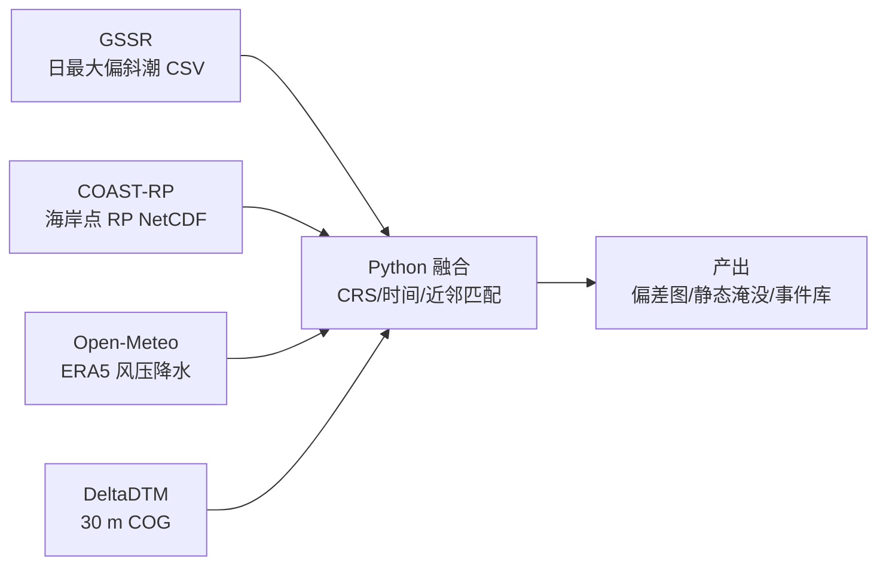

# 组合 1 实施指南：GSSR + COAST-RP + Open-Meteo ERA5 + DeltaDTM

> **工作区**：`e:\Projects\20260522-coastal-flood-scientific-data`  
> **对应总计划**：`docs/coastal-flood-integration-paper-plan.md` §5.1  
> **编制日期**：2026-05-22  
> **原则**：仅开放/免费数据；组合 1 四件套为主，其余一律标为**可选**。

---

## 1. 对您六个问题的直接回答

### 1.1 组合 1 数据是否“单独够用”？

**结论：对论文主线（模式 B + 部分模式 C）足够；对完整“事件叙事 + 复合洪水 + 观测严格验证”不够。**


| 科学任务                     | 组合 1 是否覆盖         | 说明                                         |
| ------------------------ | ----------------- | ------------------------------------------ |
| 日最大风暴潮重建（验潮站）            | ✅ GSSR            | 882 站、多再分析；建议与 Open-Meteo 用 **ERA5 重建** 对齐 |
| 全球海岸极端风暴潮位重现期            | ✅ COAST-RP        | 1–1000 年 RP；海岸点非验潮站，需空间匹配                  |
| 气象/降水驱动（统计相关、事件窗）        | ✅ Open-Meteo ERA5 | **不提供** 潮位；仅驱动因子                           |
| 30 m 海岸 DTM、静态淹没敏感性      | ✅ DeltaDTM        | bathtub 筛查；非动力淹没                           |
| GSSR vs COAST-RP 交叉验证    | ✅                 | 共站/近邻匹配 + 分位数对比                            |
| 英国事件档案（SurgeWatch）       | ❌ 可选              | 组合 3 更合适                                   |
| 全球 ESL 第三套验证（CoDEC/GTSR） | ❌ 可选              | 稳健性检验，非必需                                  |
| 验潮**观测**验证 GSSR          | ❌ 可选              | GESLA3/NOAA 仅验证，不作“新数据”                    |
| 天文潮/总水位合成                | ❌ 可选              | FES2014 等需注册                               |
| 海浪（ERA5-Ocean）           | ❌ 可选              | Marine API；组合 3 更贴切                        |
| 离岸水深 / 其他 DEM            | ❌ 可选              | GEBCO、MERIT 等                              |


用户表述“组合 1 用相关数据就足够了”——**应理解为：不强制下载 US-CoastEX、WNP、SurgeWatch、PCCFR 等即可开写；但若要做观测验证、英国事件案例或第三套 ESL 对照，需按需加可选集。**

### 1.2 确切下载什么（URL / API / 体量 / 格式）

见 §3 下载矩阵（已用 4TU、Figshare API、gssr.info 页面核对）。

### 1.3 怎么下载（命令步骤）

见 §4 分阶段步骤与 `scripts/`。

### 1.4 难度与前置条件


| 数据集                 | 难度      | 注册  | 前置技能                                |
| ------------------- | ------- | --- | ----------------------------------- |
| COAST-RP            | **易**   | 无   | 浏览器或 `curl`；`xarray` 读 NetCDF       |
| Open-Meteo ERA5     | **易**   | 无   | HTTP/JSON；注意速率与日期范围                 |
| GSSR（MVP 单站）        | **易–中** | 无   | 解压 `.7z`；pandas 读 CSV               |
| GSSR（全库 ERA5）       | **中**   | 无   | ~297 MB 下载 + 解压磁盘                   |
| DeltaDTM（索引 only）   | **易**   | 无   | GeoPackage                          |
| DeltaDTM（MVP 瓦片）    | **中**   | 无   | `geopandas`+`rasterio` 按 bbox 挑瓦片   |
| DeltaDTM（欧洲/全球 zip） | **难**   | 无   | **2.4 GB–36 GB** 级带宽与磁盘；建议 GEE 或按瓦片 |


### 1.5 推进实施的详细路线图

见 §5（与总计划 P0–P6 对齐，仅保留组合 1 范围）。

### 1.6 自审迭代

见文档末尾 **§8 三轮自审记录**。

---

## 2. 组合 1 在融合流水线中的角色




**对齐要点（须在 Methods 写明）**：

- Open-Meteo **无风暴潮** → 与 GSSR 做相关/分位/事件匹配，不替代水动力。
- COAST-RP 为**海岸点**网格，与 GSSR **验潮站** 需最近邻（建议 ≤50 km 或 0.25° 内报告敏感性）。
- 垂直基准：各产品多为 MSL 附近，但仍建议只做**相对**淹没敏感性，并引用 DeltaDTM MAE（~0.43 m）。

---

## 3. 下载矩阵


| 数据集                 | 必需？     | 来源 URL                                                                                | 获取方式             | 格式          | 估计体量            | 难度  | 备注                                      |
| ------------------- | ------- | ------------------------------------------------------------------------------------- | ---------------- | ----------- | --------------- | --- | --------------------------------------- |
| **GSSR ERA5 单站**    | MVP 必需  | `https://raw.githubusercontent.com/moinabyssinia/gssr/gh-pages/erafive/{archive}`     | 脚本/HTTP          | `.7z` → CSV | ~0.2–0.5 MB/站   | 易   | 8 站 MVP ≈ **3 MB**                      |
| **GSSR ERA5 全库**    | 扩展      | [Figshare 10.6084/m9.figshare.12970931](https://doi.org/10.6084/m9.figshare.12970931) | 浏览器/Figshare     | `.7z`       | **296 MB**      | 中   | 882 站；无需注册                              |
| **GSSR 元数据**        | 推荐      | `https://raw.githubusercontent.com/moinabyssinia/gssr/gh-pages/eraint.geojson`        | HTTP             | GeoJSON     | ~260 KB         | 易   | 站名、坐标、验证分数                              |
| **GSSR 门户**         | 参考      | [http://gssr.info](http://gssr.info)                                                  | Web 地图 / DownGit | CSV         | 按需              | 易   | 与 GitHub `erafive` 一致                   |
| **COAST-RP v2**     | **必需**  | [4TU 10.4121/13392314.v2](https://doi.org/10.4121/13392314.v2)                        | 一键 zip           | NetCDF×3    | zip **~6.8 MB** | 易   | 无需注册                                    |
| **Open-Meteo ERA5** | **必需**  | `https://archive-api.open-meteo.com/v1/archive`                                       | REST API         | JSON/CSV    | 取决于窗长           | 易   | 无 API Key                               |
| **DeltaDTM 瓦片索引**   | MVP 必需  | [4TU 10.4121/21997565.v4](https://doi.org/10.4121/21997565.v4)                        | 直链文件             | GeoPackage  | **~2.9 MB**     | 易   | `deltadtm_tiles.gpkg`                   |
| **DeltaDTM Europe** | MVP+ 推荐 | 同上 v4 数据集页                                                                            | 直链               | zip→COG tif | **~2.39 GB**    | 中–难 | 含英国/北海                                  |
| **DeltaDTM 全球**     | 完整版     | 同上（各洲 zip）                                                                            | zip              | COG         | **~36 GB** 解压   | 难   | 或 GEE: `users/maartenpronk/deltadtm/v1` |
| CoDEC/GTSR          | 可选      | [Zenodo 10.5281/zenodo.3660927](https://doi.org/10.5281/zenodo.3660927)               | zenodo_get       | NetCDF      | 中等              | 中   | RP 交叉验证                                 |
| GESLA3 观测           | 可选      | [gesla.org](https://www.gesla.org/)                                                   | CSV              | 观测潮位        | 按需              | 中   | **仅验证**                                 |
| SurgeWatch2         | 可选      | [surgewatch.org](http://www.surgewatch.org)                                           | 手动               | XLSX/CSV    | <50 MB          | 易   | 非组合 1 核心                                |


### 3.1 MVP 最小下载量估算


| 档位           | 内容                                                            | 约计磁盘               |
| ------------ | ------------------------------------------------------------- | ------------------ |
| **MVP-min**  | COAST-RP + 8×GSSR `.7z` + DTM 索引 + Open-Meteo 气候态窗（1980–2010） | **30–80 MB**       |
| **MVP+地形**   | MVP-min + `Europe.zip` 或 bbox 内 ~30 瓦片                        | **0.15–2.5 GB**    |
| **分析就绪（推荐）** | MVP+ + 解压 COAST-RP + 解压 GSSR + 事件窗 Open-Meteo                 | **+20–50 MB** 处理空间 |


---

## 4. 分阶段实施（Phase 0–4）

### Phase 0：环境（使用仓库已有文件）

```powershell
cd e:\Projects\20260522-coastal-flood-scientific-data

# 任选其一
conda env create -f environment.yml
conda activate coastal-flood-integration

# 或
python -m venv .venv
.\.venv\Scripts\activate
pip install -r requirements.txt
```

**检验**：`python -c "import xarray, geopandas, rasterio, requests, yaml; print('ok')"`

---

### Phase 1：下载核心静态数据

```powershell
# MVP：COAST-RP + 8 站 GSSR + DeltaDTM 索引
python scripts\download_combo1.py --tier mvp-min --extract

# 若需英国/北海淹没瓦片（大文件，可选）
python scripts\download_combo1.py --tier mvp-terrain --extract

# 校验
python scripts\verify_downloads.py --strict
```

**COAST-RP 手动备用**（浏览器）：

1. 打开 [https://data.4tu.nl/articles/_/13392314/2](https://data.4tu.nl/articles/_/13392314/2)
2. 点击 **download all files (zip)**
3. 解压到 `data/raw/coast_rp/extracted/`

**GSSR 单站手动备用**：

```text
https://raw.githubusercontent.com/moinabyssinia/gssr/gh-pages/erafive/sheerness_p015_uk.7z
```

解压需 **7-Zip** 或 `pip install py7zr`。

**GSSR 全库 ERA5（可选）**：

- DOI: [10.6084/m9.figshare.12970931](https://doi.org/10.6084/m9.figshare.12970931)  
- 直链: `https://ndownloader.figshare.com/files/25187327` → `eraFiveSurgeReconstruction.7z`（296 MB）

---

### Phase 1b：Open-Meteo ERA5

**端点**：`https://archive-api.open-meteo.com/v1/archive`

**推荐参数**（与总计划 §2.1 一致）：


| 参数         | 值                                                                             |
| ---------- | ----------------------------------------------------------------------------- |
| `models`   | `era5`                                                                        |
| `hourly`   | `pressure_msl,wind_speed_10m,wind_direction_10m,wind_gusts_10m,precipitation` |
| `timezone` | `UTC`（与 GSSR 日最大对齐）                                                           |
| 气候态窗       | `1980-01-01` … `2010-12-31`                                                   |
| 事件窗（英案例）   | `2013-12-01` … `2014-02-28`                                                   |


**curl 示例（Sheerness）**：

```bash
curl -o sheerness_era5.json "https://archive-api.open-meteo.com/v1/archive?latitude=51.442&longitude=0.74306&start_date=2014-01-01&end_date=2014-01-31&hourly=pressure_msl,wind_speed_10m,wind_gusts_10m,precipitation&models=era5&timezone=UTC"
```

**Python 脚本**：

```powershell
# 气候态（默认 1980–2010，8 站）
python scripts\download_open_meteo.py --mode climatology

# 英国风暴事件窗
python scripts\download_open_meteo.py --mode event

# 单站试跑
python scripts\download_open_meteo.py --station-id sheerness-p015-uk --start 2014-01-01 --end 2014-01-31
```

**限制**：免费档约 **600 次/分钟、5k–10k 次/天**（以 [官方文档](https://open-meteo.com/en/docs/historical-weather-api) 为准）。长时段 × 多站请分批并 `--sleep 1`。

**失败模式**：

- `400`：日期超出 ERA5 可用范围（通常 1940 年后；组合 1 用 1979+ 与 GSSR ERA5 一致）。  
- 超时：缩短日期或分年下载后合并。

---

### Phase 2：预处理与 harmonize（`src/` 待建）

**目标表结构**（`data/processed/`）：

1. `stations.parquet` — `config/combo1_stations.yaml` + GSSR 元数据
2. `gssr_daily.parquet` — 日最大偏斜潮
3. `coast_rp_nearest.parquet` — 每站最近 COAST-RP 点 + RP10/100
4. `drivers_daily.parquet` — Open-Meteo 日极值（风压 min、降水 sum 等）

**伪代码：GSSR 解压与读取**

```python
import py7zr, pandas as pd
from pathlib import Path

archive = Path("data/raw/gssr/era5/sheerness_p015_uk.7z")
out = Path("data/raw/gssr/era5/extracted/sheerness")
out.mkdir(parents=True, exist_ok=True)
with py7zr.SevenZipFile(archive, mode="r") as z:
    z.extractall(path=out)
# 读取 CSV：列名以文件为准（通常含日期与日最大 surge）
```

**伪代码：COAST-RP 最近邻**

```python
import xarray as xr
from scipy.spatial import cKDTree
import numpy as np

ds = xr.open_dataset("data/raw/coast_rp/extracted/COAST-RP.nc")
# 假设变量含 return periods: 需读 README.txt 确认维名
lon = ds["lon"].values
lat = ds["lat"].values
tree = cKDTree(np.column_stack([lon, lat]))
dist, idx = tree.query([[st_lon, st_lat]], k=1)
```

**伪代码：Open-Meteo 日对齐 GSSR**

```python
# 对每个 UTC 日：pressure_msl=min, precipitation=sum, wind_speed_10m=max
```

**QC（Phase 2 末）**：见 §7。

---

### Phase 3：分析（模式 B + 静态淹没 C）


| 分析               | 输入                       | 方法                                                   |
| ---------------- | ------------------------ | ---------------------------------------------------- |
| **B. 气候态 RP 对比** | GSSR 极值 vs COAST-RP RP   | 分位/回归；分 TC/ETC（`COAST-RP_TC.nc` / `COAST-RP_ETC.nc`） |
| **驱动–潮相关**       | GSSR + Open-Meteo        | Spearman；风压 min vs 日最大潮                              |
| **C. 静态淹没**      | COAST-RP 100y + DeltaDTM | `max(0, ESL_100y - DTM)`；UTM 局部投影                    |


**伪代码：bathtub（敏感性，非预报）**

```python
import rioxarray
esl_100 = ...  # m, 与 DTM 垂直基准一致或仅做相对差
dtm = rioxarray.open_rasterio("data/raw/deltadtm/tiles/DeltaDTM_v1_0_N51E001.tif")
inundation = (esl_100 - dtm).clip(min=0)
```

---

### Phase 4：可复现与写作

- 锁定 DOI + 下载日期 + `data/manifest.json`（`verify_downloads.py` / `download_combo1.py` 生成）  
- 图表：Fig.4（GSSR–COAST-RP）、Fig.5（DTM 淹没）、Suppl. API 模板  
- 目标期刊：*Scientific Data* 数据融合说明 或 *Natural Hazards* / *ESSD* 工作流文

---

## 5. 详细推进计划（8–10 周，仅组合 1）


| 周      | 任务                                 | 交付物                   |
| ------ | ---------------------------------- | --------------------- |
| W1     | Phase 0–1；`verify_downloads.py` 全绿 | 原始数据 + manifest       |
| W2     | 解压 GSSR；读 COAST-RP；Open-Meteo 日聚合  | `processed/*.parquet` |
| W3     | 最近邻匹配；RP 散点（Fig.4 草稿）              | 验证表 Table 2 雏形        |
| W4     | DeltaDTM MVP 瓦片裁剪；bathtub 100y     | GeoTIFF 敏感性图          |
| W5     | 驱动–潮相关 + 不确定性说明                    | Methods 初稿            |
| W6–W7  | 可选：CoDEC 对照 / GESLA 验证             | 附录图                   |
| W8–W10 | 全文 + 代码 Zenodo 快照                  | 投稿包                   |


**MVP 验收标准（最低发表数据说明）**：

- ≥8 验潮站 GSSR + COAST-RP 匹配表  
- ≥1 区域 Open-Meteo 与 GSSR 相关结果  
- ≥1 区域静态淹没敏感性图（注明 DTM 误差）

---

## 6. 三大阻塞项（诚实评估）

1. **DeltaDTM 体量**：全球 v1.1 解压约 **36 GB**；MVP 应用 bbox+瓦片或 `Europe.zip`（2.4 GB），否则磁盘/带宽成瓶颈。
2. **空间异质匹配**：COAST-RP（海岸点）与 GSSR（验潮站）不是同一网格，最近邻距离需报告，否则 RP 对比偏差大。
3. **垂直基准与产品定义**：风暴潮重建 vs 风暴潮位 RP（含潮）定义不同；静态淹没宜强调**相对敏感性**而非绝对水深。

---

## 7. 下载后 QC 清单


| 步骤         | 检查项                   | 通过标准                                 |
| ---------- | --------------------- | ------------------------------------ |
| COAST-RP   | `verify_downloads.py` | zip 可开；`COAST-RP.nc` 存在              |
| COAST-RP   | `xarray` 打开           | 维度和 RP 变量无全 NaN                      |
| GSSR       | 每站 `.7z`              | 大小 >10 KB；可解压出 CSV                   |
| GSSR       | CSV                   | 日期单调；日最大 surge 数值合理（如 −2–5 m 量级依站而异） |
| Open-Meteo | JSON                  | `hourly.time` 长度与日期窗一致               |
| Open-Meteo | 物理合理性                 | `pressure_msl` 约 950–1050 hPa；风非负    |
| DeltaDTM   | `deltadtm_tiles.gpkg` | 与 bbox 相交瓦片数 >0                      |
| DeltaDTM   | 单瓦片 COG               | `rasterio` 可读；nodata 比例可接受           |
| 融合         | 站表                    | 每站 GSSR、COAST-RP、OM 时间窗有重叠           |


---

## 8. 三轮自审记录

### 第 1 轮（对照 `coastal-flood-integration-paper-plan.md` 起草）

- 四数据集与 §5.1 一致  
- Open-Meteo 定位为驱动因子，非潮位  
- 可选数据明确标为 SurgeWatch/CoDEC/GESLA 等  
- 补充 MVP 与完整版分级

### 第 2 轮（外链与 API 核实）


| 项            | 核实结果                                                    | 修正                              |
| ------------ | ------------------------------------------------------- | ------------------------------- |
| COAST-RP     | 4TU v2 zip **6,798,509 B**                              | 使用 `ndownloader/.../versions/2` |
| GSSR ERA5 全库 | Figshare API：**310,671,313 B**；文件 `25187327`            | 修正脚本直链                          |
| GSSR 单站      | GitHub `erafive` 841 个 `.7z`                            | 站名与 `combo1_stations.yaml` 对齐   |
| DeltaDTM     | v4 最新；Europe **2,386,070,935 B**                        | 注明 v1.1 与论文 v1.0 差异             |
| Open-Meteo   | `archive-api.open-meteo.com/v1/archive` + `models=era5` | curl/Python 示例已写                |


### 第 3 轮（失败模式、磁盘、MVP）

- 增加速率限制、400 日期、7z 解压依赖  
- MVP-min **30–80 MB** vs Europe **2.4 GB** vs 全球 **36 GB**  
- 三大阻塞项写入 §6  
- 提供 `scripts/download_combo1.py`、`download_open_meteo.py`、`verify_downloads.py`

---

## 9. 配置文件与脚本索引


| 路径                                        | 用途                            |
| ----------------------------------------- | ----------------------------- |
| `config/combo1_stations.yaml`             | 8 个 MVP 验潮站（可扩展）              |
| `scripts/download_combo1.py`              | COAST-RP + GSSR + DeltaDTM 索引 |
| `scripts/download_open_meteo.py`          | ERA5 气象驱动                     |
| `scripts/verify_downloads.py`             | 完整性检查                         |
| `scripts/match_stations_to_coastrp.py`    | GSSR 站 ↔ COAST-RP 最近邻         |
| `scripts/merge_gssr_coastrp.py`           | 日潮位 + RP 对比指标                 |
| `scripts/fetch_open_meteo_climatology.py` | Open-Meteo 日聚合 + 相关           |
| `scripts/inundation_sensitivity.py`       | 静态淹没 +0.5/1/2 m（MVP）          |
| `scripts/run_combo1_pipeline.py`          | **一键处理流水线**（末尾生成 HTML）        |
| `scripts/generate_html_reports.py`        | 自包含 HTML 完整报告（`combo1_complete_report.html`） |
| `scripts/validate_standalone_html.py`     | 校验 HTML 无外链/相对资源依赖              |
| `data/README.md`                          | 目录约定                          |


---

## 11. 执行状态（2026-05-22 自动化运行）


| 步骤                         | 状态  | 备注                                           |
| -------------------------- | --- | -------------------------------------------- |
| MVP-min 下载 + 校验            | ✅   | `verify_downloads.py --strict` 全绿            |
| Open-Meteo 气候态 8 站         | ✅   | 首轮 429 限流；`--sleep 8` 重试成功                   |
| GSSR 解压                    | ✅   | `py7zr` 不可用 → 7-Zip CLI（见 `combo1_utils.py`） |
| 处理流水线                      | ✅   | `python scripts\run_combo1_pipeline.py`      |
| 图表 + `combo1_summary.json` | ✅   | 见 `figures/`、`data/processed/`               |
| DeltaDTM 真实瓦片淹没            | ✅   | `Europe.zip` 完整；`N51E000` COG；Sheerness 真实 DEM     |
| HTML 完整报告（自包含）              | ✅   | `reports/combo1_complete_report.html`（单文件主入口） |


**磁盘**：约 **0.27 GB**（Open-Meteo 占 ~245 MB）。

**详细日志**：`docs/combo1-execution-log.md` · `logs/combo1-run-20260522.md`

**复现**：

```powershell
cd e:\Projects\20260522-coastal-flood-scientific-data
python scripts\download_combo1.py --tier mvp-min --extract
python scripts\download_open_meteo.py --mode climatology --sleep 5
python scripts\verify_downloads.py --strict
python scripts\run_combo1_pipeline.py
```

### 刷新 HTML 报告（无需重跑处理时）

流水线最后一步会调用 `generate_html_reports.py`。单独刷新：

```powershell
cd e:\Projects\20260522-coastal-flood-scientific-data
python scripts\generate_html_reports.py
python scripts\validate_standalone_html.py
start reports\combo1_complete_report.html
```

**主产出**：`reports/combo1_complete_report.html` — 单文件完整报告（内联 CSS、base64 图、HTML 表），可离线 `file://` 打开。可选：`combo1_data_report.html`、`combo1_analysis_report.html`。不再生成依赖 `style.css` 或 `assets/` 的多页外链报告。

---

## 10. 参考文献（组合 1 核心）

1. Tadesse, M.G., Wahl, T. Sci Data **8**, 125 (2021). [https://doi.org/10.1038/s41597-021-00906-x](https://doi.org/10.1038/s41597-021-00906-x)
2. Dullaart, J.C.M. et al. Commun Earth Environ **2**, 221 (2021). [https://doi.org/10.1038/s43247-021-00204-9](https://doi.org/10.1038/s43247-021-00204-9)
3. Pronk, M. et al. Sci Data **11**, 273 (2024). [https://doi.org/10.1038/s41597-024-03091-9](https://doi.org/10.1038/s41597-024-03091-9)
4. Open-Meteo Historical API: [https://open-meteo.com/en/docs/historical-weather-api](https://open-meteo.com/en/docs/historical-weather-api)

---

*实施前请在各数据源页面再次确认版本号；若 4TU/Figshare 更新，请同步修改 `scripts/download_combo1.py` 中 `SOURCES`。*